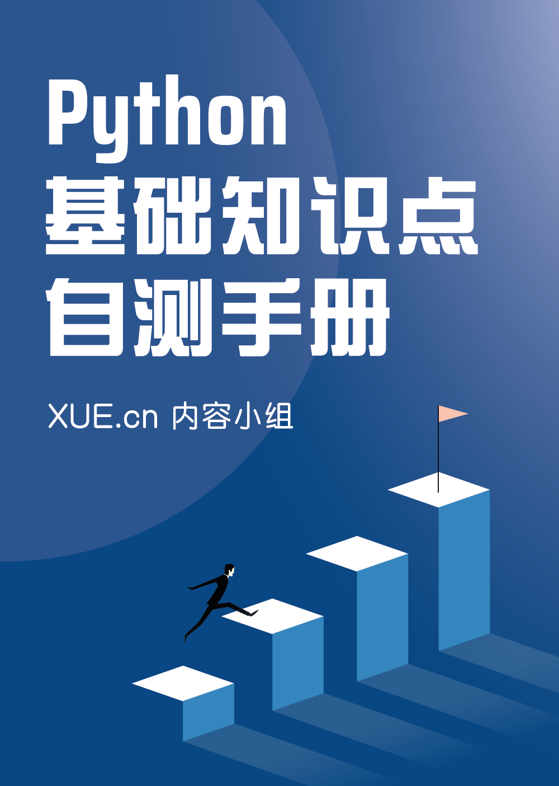

# 目录

## 数字
- [数字类型概述](01_numeric/01_numeric.ipynb)
- [整数及其位运算](01_numeric/02_int.ipynb)
- [布尔值及布尔运算](01_numeric/03_bool.ipynb)
- [浮点数](01_numeric/04_float.ipynb)
- [复数](01_numeric/05_complex.ipynb)
- [数字运算](01_numeric/06_number_operations.ipynb)

## 字符串
- [字符串概述](02_string/01_string.ipynb)
- [字符串拼接](02_string/02_concatenated_string.ipynb)
- [转义字符](02_string/03_escape_character.ipynb)
- [str.count 统计](02_string/04_str.count.ipynb)
- [str.replace 替换](02_string/05_str.replace.ipynb)
- [str.expandtabs 替换制表符](02_string/06_str.expandtabs.ipynb)
- [str.split 拆分](02_string/07_str.split.ipynb)
- [str.rsplit 拆分](02_string/08_str.rsplit.ipynb)
- [str.partition 拆分](02_string/09_str.partition.ipynb)
- [str.rpartition 拆分](02_string/10_str.rpartition.ipynb)
- [str.splitlines 按行拆分](02_string/11_str.splitlines.ipynb)
- [str.strip 移除两边字符](02_string/12_str.strip.ipynb)
- [str.lstrip 移除左边字符](02_string/13_str.lstrip.ipynb)
- [str.rstrip 移除右边字符](02_string/14_str.rstrip.ipynb)
- [str.find 查找最小索引](02_string/15_str.find.ipynb)
- [str.rfind 查找最大索引](02_string/16_str.rfind.ipynb)
- [str.index 查找最小索引](02_string/17_str.index.ipynb)
- [str.rindex 查找最大索引](02_string/18_str.rindex.ipynb)
- [str.join 拼接字符串](02_string/19_str.join.ipynb)
- [str.startswith 指定字符串开头？](02_string/20_str.startswith.ipynb)
- [str.endswith 指定字符串结尾？](02_string/21_str.endswith.ipynb)
- [str.ljust 左对齐](02_string/22_str.ljust.ipynb)
- [str.center 居中](02_string/23_str.center.ipynb)
- [str.rjust 右对齐](02_string/24_str.rjust.ipynb)
- [str.format 格式化](02_string/25_str.format.ipynb)
- [str.format_map 格式化](02_string/26_str.format_map.ipynb)
- [f-string 格式化字符串](02_string/27_f-string.ipynb)
- [字符串操作符](02_string/28_string_operators.ipynb)
- [str.encode 编码为字节串](02_string/29_str.encode.ipynb)
- [str.capitalize 首字符大写](02_string/30_str.capitalize.ipynb)
- [str.casefold 消除大小写](02_string/31_str.casefold.ipynb)
- [str.lower 转小写](02_string/32_str.lower.ipynb)
- [str.title 单词首字母大写](02_string/33_str.title.ipynb)
- [str.upper 转大写](02_string/34_str.upper.ipynb)
- [str.swapcase 大小写互转](02_string/35_str.swapcase.ipynb)
- [str.zfill 填充 0 ](02_string/36_str.zfill.ipynb)
- [str.translate 按表转换](02_string/37_str.translate.ipynb)
- [str.maketrans 生成转换表](02_string/38_str.maketrans.ipynb)
- [str.isalnum 是字母或数字？](02_string/39_str.isalnum.ipynb)
- [str.isalpha 是字母（包括汉字等）？](02_string/40_str.isalpha.ipynb)
- [str.isdecimal 是十进制字符？](02_string/41_str.isdecimal.ipynb)
- [str.isdigit 是数字？](02_string/42_str.isdigit.ipynb)
- [str.isnumeric 是数值字符？](02_string/43_str.isnumeric.ipynb)
- [str.islower 是小写？](02_string/44_str.islower.ipynb)
- [str.isupper 是大写？](02_string/45_str.isupper.ipynb)
- [str.istitle 是标题字符串？](02_string/46_str.istitle.ipynb)
- [str.isascii 是 ASCII 字符？](02_string/47_str.isascii.ipynb)
- [str.isidentifier 是有效标识符？](02_string/48_str.isidentifier.ipynb)
- [str.isprintable 是可打印字符？](02_string/49_str.isprintable.ipynb)
- [str.isspace 是空白字符？](02_string/50_str.isspace.ipynb)
- [str.removeprefix  移除前缀](02_string/51_str.removeprefix.ipynb)
- [str.removesuffix 移除后缀](02_string/52_str.removesuffix.ipynb)

## 列表
- [列表概述](03_list/01_list.ipynb)
- [列表推导式](03_list/02_list_comprehension.ipynb)
- [列表的索引和切片](03_list/03_list_indexes_and_slices.ipynb)
- [列表操作符](03_list/04_list_operator.ipynb)
- [list.append 添加一个元素](03_list/05_list.append.ipynb)
- [list.extend 加入可迭代对象中元素](03_list/06_list.extend.ipynb)
- [list.insert 插入一个元素](03_list/07_list.insert.ipynb)
- [list.sort 对列表原地排序](03_list/08_list.sort.ipynb)
- [list.reverse 反转列表中元素](03_list/09_list.reverse.ipynb)
- [list.pop 删除元素并返回](03_list/10_list.pop.ipynb)
- [list.remove 移除一个元素](03_list/11_list.remove.ipynb)
- [list.count 统计元素出现次数](03_list/12_list.count.ipynb)
- [list.index 查找最小索引](03_list/13_list.index.ipynb)
- [list.copy 列表的一个浅拷贝](03_list/14_list.copy.ipynb)
- [list.clear 删除所有元素](03_list/15_list.clear.ipynb)

## 元组
- [元组概述](04_tuple/01_tuple.ipynb)
- [tuple.count 统计元素出现次数](04_tuple/02_tuple.count.ipynb)
- [tuple.index 查找元素索引](04_tuple/03_tuple.index.ipynb)
- [元组操作符](04_tuple/04_operator.ipynb)

## 序列
- [序列类型概述](05_sequence/01_sequence.ipynb)
- [range 对象](05_sequence/02_range.ipynb)
- [序列索引和切片](05_sequence/03_index_slice.ipynb)
- [序列通用操作](05_sequence/04_common_operations.ipynb)

## 集合
- [集合概述](06_set/01_set.ipynb)
- [set.isdisjoint 交集为空吗？](06_set/02_set.isdisjoint.ipynb)
- [set.issubset 是子集吗？](06_set/03_set.issubset.ipynb)
- [set.issuperset 是超集吗？](06_set/04_set.issuperset.ipynb)
- [set.union 并集](06_set/05_set.union.ipynb)
- [set.intersection 交集](06_set/06_set.intersection.ipynb)
- [set.difference 差集](06_set/07_set.difference.ipynb)
- [set.symmetric_difference 对称差](06_set/08_set.symmetric_difference.ipynb)
- [set.copy 浅拷贝](06_set/09_set.copy.ipynb)
- [set.update 合并更新](06_set/10_set.update.ipynb)
- [set.intersection_update 交集更新](06_set/11_set.intersection_update.ipynb)
- [set.difference_update 差集更新](06_set/12_set.difference_update.ipynb)
- [set ^= other 对称差集更新](06_set/13_set.symmetric_difference_update.ipynb)
- [set.add 添加元素](06_set/14_set.add.ipynb)
- [set.remove 删除元素](06_set/15_set.remove.ipynb)
- [set.discard 删除元素](06_set/16_set.discard.ipynb)
- [set.pop 删除元素并返回](06_set/17_set.pop.ipynb)
- [set.clear 清空集合元素](06_set/18_set.clear.ipynb)

## 字典
- [字典概述](07_dictionary/01_dict.ipynb)
- [dict.keys 键视图](07_dictionary/02_dict.keys.ipynb)
- [dict.values 值视图](07_dictionary/03_dict.values.ipynb)
- [dict.items 键值对视图](07_dictionary/04_dict.items.ipynb)
- [dict.get 获取某个键的值](07_dictionary/05_dict.get.ipynb)
- [dict.copy 浅拷贝](07_dictionary/06_dict.copy.ipynb)
- [dict.pop 删除元素并返回值](07_dictionary/07_dict.pop.ipynb)
- [dict.popitem 删除元素并返回键值对](07_dictionary/08_dict.popitem.ipynb)
- [dict.fromkeys 创建字典](07_dictionary/09_dict.fromkeys.ipynb)
- [dict.clear 清空字典元素](07_dictionary/10_dict.clear.ipynb)
- [dict.setdefault 获取或插入元素](07_dictionary/11_dict.setdefault.ipynb)
- [dict.update 更新字典](07_dictionary/12_dict.update.ipynb)
- [字典遍历](07_dictionary/13_loop_through.ipynb)
- [字典操作符](07_dictionary/14_operator.ipynb)

## 其他类型
- [空值 None](08_other_types/01_none.ipynb)
- [生成器表达式和推导式](08_other_types/02_comprehension.ipynb)
- [其他内置类型](08_other_types/03_other_types.ipynb)

## 操作符
- [操作符概述](09_operator/01_operator_summary.ipynb)
- [比较运算符](09_operator/02_compare.ipynb)
- [操作符优先级](09_operator/03_precedence.ipynb)
- [操作符特殊用法](09_operator/04_special.ipynb)

## 语句
- [表达式语句](10_statement/01_expression.ipynb)
- [赋值语句](10_statement/02_assignment.ipynb)
- [if 条件判断](10_statement/03_if.ipynb)
- [for 循环](10_statement/04_for.ipynb)
- [while 循环](10_statement/05_while.ipynb)
- [break 语句](10_statement/06_break.ipynb)
- [continue 语句](10_statement/07_continue.ipynb)
- [del 语句](10_statement/08_del.ipynb)
- [pass 语句](10_statement/09_pass.ipynb)
- [def 定义函数](10_statement/10_def.ipynb)
- [return 语句](10_statement/11_return.ipynb)
- [yield 语句](10_statement/12_yield.ipynb)
- [class 定义类](10_statement/13_class.ipynb)
- [try 语句](10_statement/14_try.ipynb)
- [raise 语句](10_statement/15_raise.ipynb)
- [with 语句](10_statement/16_with.ipynb)
- [assert 语句](10_statement/17_assert.ipynb)
- [import 导入语句](10_statement/18_import.ipynb)
- [global 语句](10_statement/19_global.ipynb)
- [nonlocal 语句](10_statement/20_nonlocal.ipynb)

## 内建函数
- [abs() 数字取绝对值](11_built-in_function/01_abs.ipynb)
- [all() 所有元素布尔值为真？](11_built-in_function/02_all.ipynb)
- [any() 有一个元素布尔值为真？](11_built-in_function/03_any.ipynb)
- [ascii() 返回对象的可打印字符串](11_built-in_function/04_ascii.ipynb)
- [bin() 整数的二进制形式](11_built-in_function/05_bin.ipynb)
- [bool 返回对象的布尔值](11_built-in_function/06_bool.ipynb)
- [bytes 创建 bytes 对象](11_built-in_function/07_bytes.ipynb)
- [callable() 是可调用对象？](11_built-in_function/08_callable.ipynb)
- [chr() 返回 Unicode 码位值对应字符](11_built-in_function/09_chr.ipynb)
- [classmethod 封装函数为类方法](11_built-in_function/10_classmethod.ipynb)
- [compile() 创建代码对象](11_built-in_function/11_compile.ipynb)
- [complex 创建复数](11_built-in_function/12_complex.ipynb)
- [delattr() 删除对象属性](11_built-in_function/13_delattr.ipynb)
- [dict 创建字典](11_built-in_function/14_dict.ipynb)
- [dir() 返回对象属性列表](11_built-in_function/15_dir.ipynb)
- [divmod() 求两个数的商和余](11_built-in_function/16_divmod.ipynb)
- [enumerate 枚举](11_built-in_function/17_enumerate.ipynb)
- [eval() 解析字符串或代码并求值](11_built-in_function/18_eval.ipynb)
- [exec() 解析字符串或代码并求值](11_built-in_function/19_exec.ipynb)
- [filter 真值元素筛选](11_built-in_function/20_filter.ipynb)
- [float 创建浮点数](11_built-in_function/21_float.ipynb)
- [format() 格式化](11_built-in_function/22_format.ipynb)
- [frozenset 创建不可变集合](11_built-in_function/23_frozenset.ipynb)
- [getattr() 获取对象的属性](11_built-in_function/24_getattr.ipynb)
- [globals() 返回全局变量字典](11_built-in_function/25_globals.ipynb)
- [hasattr() 是对象的属性吗？](11_built-in_function/26_hasattr.ipynb)
- [hash() 返回对象的哈希值](11_built-in_function/27_hash.ipynb)
- [help 启动帮助系统](11_built-in_function/28_help.ipynb)
- [hex() 整数的十六进制形式](11_built-in_function/29_hex.ipynb)
- [id() 返回对象的唯一标识](11_built-in_function/30_id.ipynb)
- [input() 接受输入返回字符串](11_built-in_function/31_input.ipynb)
- [int 创建整数](11_built-in_function/32_int.ipynb)
- [isinstance() 是给定类的实例？](11_built-in_function/33_isinstance.ipynb)
- [issubclass() 是给定类的子类吗？](11_built-in_function/34_issubclass.ipynb)
- [iter() 转迭代器](11_built-in_function/35_iter.ipynb)
- [len() 返回元素个数](11_built-in_function/36_len.ipynb)
- [list 创建列表](11_built-in_function/37_list.ipynb)
- [locals() 返回局部变量的字典](11_built-in_function/38_locals.ipynb)
- [map 以给定函数转换元素](11_built-in_function/39_map.ipynb)
- [max() 求最大项](11_built-in_function/40_max.ipynb)
- [min() 求最小项](11_built-in_function/41_min.ipynb)
- [next() 返回迭代器下一个元素](11_built-in_function/42_next.ipynb)
- [object 所有类的基类](11_built-in_function/43_object.ipynb)
- [oct() 整数的八进制形式](11_built-in_function/44_oct.ipynb)
- [open() 打开文件](11_built-in_function/45_open.ipynb)
- [ord() 返回单个字符 Unicode 码位值](11_built-in_function/46_ord.ipynb)
- [pow() 幂运算并取余](11_built-in_function/47_pow.ipynb)
- [print() 打印对象](11_built-in_function/48_print.ipynb)
- [property 返回 property 属性](11_built-in_function/49_property.ipynb)
- [range 创建 range 序列](11_built-in_function/50_range.ipynb)
- [repr() 返回对象的可打印字符串](11_built-in_function/51_repr.ipynb)
- [reversed 序列逆置](11_built-in_function/52_reversed.ipynb)
- [round() 数字舍入](11_built-in_function/53_round.ipynb)
- [set 创建集合](11_built-in_function/54_set.ipynb)
- [setattr() 设置或新增属性](11_built-in_function/55_setattr.ipynb)
- [slice 创建切片对象](11_built-in_function/56_slice.ipynb)
- [sorted() 返回排序列表](11_built-in_function/57_sorted.ipynb)
- [staticmethod 封装函数为静态方法](11_built-in_function/58_staticmethod.ipynb)
- [str 创建字符串](11_built-in_function/59_str.ipynb)
- [sum() 数字求和或序列拼接](11_built-in_function/60_sum.ipynb)
- [super 调用委托给父类或兄弟类](11_built-in_function/61_super.ipynb)
- [tuple 创建元组](11_built-in_function/62_tuple.ipynb)
- [type 判断类型或创建类](11_built-in_function/63_type.ipynb)
- [vars() 返回对象的变量字典](11_built-in_function/64_vars.ipynb)
- [zip 重组可迭代对象](11_built-in_function/65_zip.ipynb)

## 函数
- [函数概述](12_function/01_function_summary.ipynb)
- [函数定义](12_function/02_function_definition.ipynb)
- [函数形参](12_function/03_formal_parameter.ipynb)
- [函数返回值](12_function/04_return_value.ipynb)
- [递归函数](12_function/05_recursion.ipynb)
- [函数文档](12_function/06_doc.ipynb)
- [函数调用](12_function/07_function_call.ipynb)
- [lambda 函数](12_function/08_lambda.ipynb)
- [生成器函数](12_function/09_generator.ipynb)

## 错误和异常
- [错误和异常](13_exception/01_ex_summary.ipynb)
- [处理异常](13_exception/02_handling.ipynb)
- [抛出异常](13_exception/03_raising.ipynb)
- [自定义异常](13_exception/04_user_defined.ipynb)
- [finally 清理操作](13_exception/05_finally.ipynb)

## 文件
- [文件对象概述](14_file/01_file_summary.ipynb)
- [读取文件内容](14_file/02_read.ipynb)
- [文件写入内容](14_file/03_write.ipynb)

## 模块
- [模块概述](15_module/01_module_summary.ipynb)
- [创建模块](15_module/02_create_module.ipynb)
- [可执行文件](15_module/04_executable_file.ipynb)
- [导入操作](15_module/05_import_code.ipynb)

## 对象和类
- [面向对象概述](16_class/01_class_summary.ipynb)
- [类定义](16_class/02_class_definition.ipynb)
- [实例](16_class/03_instance.ipynb)
- [对象](16_class/04_object.ipynb)
- [名称](16_class/05_name.ipynb)
- [变量](16_class/06_variable.ipynb)
- [属性](16_class/07_attribute.ipynb)
- [方法](16_class/08_method.ipynb)
- [命名空间](16_class/09_namespace.ipynb)
- [作用域](16_class/10_scope.ipynb)
- [创建实例](16_class/11_create_instance.ipynb)
- [属性操作](16_class/12_attribute_operation.ipynb)
- [方法操作](16_class/13_method_operation.ipynb)
- [类继承](16_class/14_inheritance.ipynb)
